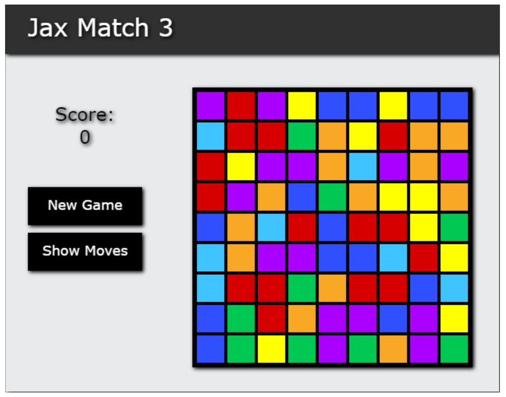

# Jax Match 3

https://jaxpi.github.io/jax-match-3/   

## Description

This a very simple match-3 game created with only HTML and JavaScript. It allows users to try to make rows or columns of 3 or more tiles of the same color. Those tiles will then clear and shift to fill the game board with new tiles. Any newly rendered tiles that are already matches will automatically clear and be added to the point total. The user can see their score and see available moves if they are stuck. If no further moves can be made the game ends. The user can begin a new game at any time.

## Installation

There is no installation needed, the game can be played in the browser as-is.

## Usage

To use, simply open the application in a browser window and begin either dragging or clicking an selecting tiles to swap with another either above, below, to the left, or to the right of it to make a row or column of at least 3 tiles of the same color. Clicking "New Game" will reset the board to a random set of tiles - this can be done at any time but is necessary to begin a new game when there are no more available moves to make. Clicking "Show Moves" will place markers on any available moves if help is needed. The button text will change to "Hide Moves" and will remove the markers upon clicking again.

## Credits

This project was created following the tutorial of the article "How to Make a Match3 Game with HTML5 Canvas" from Rembound.com. The links to the article and the GitHub repository are included below.

https://rembound.com/articles/how-to-make-a-match3-game-with-html5-canvas  
https://github.com/rembound/Match-3-Game-HTML5

## License

MIT License

Copyright (c) 2022 Jackson Impellizeri

Permission is hereby granted, free of charge, to any person obtaining a copy
of this software and associated documentation files (the "Software"), to deal
in the Software without restriction, including without limitation the rights
to use, copy, modify, merge, publish, distribute, sublicense, and/or sell
copies of the Software, and to permit persons to whom the Software is
furnished to do so, subject to the following conditions:

The above copyright notice and this permission notice shall be included in all
copies or substantial portions of the Software.

THE SOFTWARE IS PROVIDED "AS IS", WITHOUT WARRANTY OF ANY KIND, EXPRESS OR
IMPLIED, INCLUDING BUT NOT LIMITED TO THE WARRANTIES OF MERCHANTABILITY,
FITNESS FOR A PARTICULAR PURPOSE AND NONINFRINGEMENT. IN NO EVENT SHALL THE
AUTHORS OR COPYRIGHT HOLDERS BE LIABLE FOR ANY CLAIM, DAMAGES OR OTHER
LIABILITY, WHETHER IN AN ACTION OF CONTRACT, TORT OR OTHERWISE, ARISING FROM,
OUT OF OR IN CONNECTION WITH THE SOFTWARE OR THE USE OR OTHER DEALINGS IN THE
SOFTWARE.
